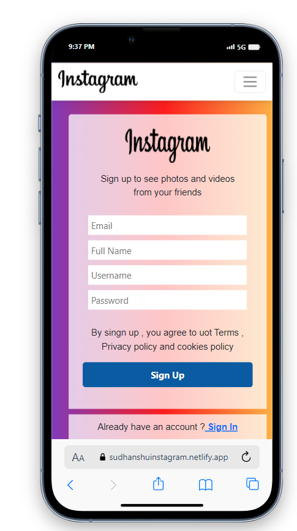

<h1>Instagram WebApp</h1>

The Instagram clone project is a MERN stack-based web app with a create post system and comments and JWT
authenƟcaƟon react and MongoDB for storage.

It replicates the core features of Instagram, user-generated content storage, user login, and backend architecture.

<h5>Tech Stack :- </h5>

React Js, Node Js, Express js, MongoDB, HTML, CSS, Bootstrap

<h5>Live Demo :- </h5>
